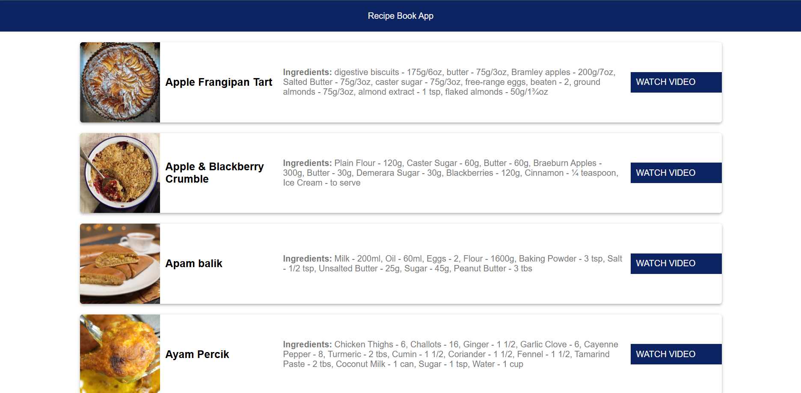

# 🍽️ Recipe Book App

The **Recipe Book App** is a simple and interactive web application built using **HTML**, **CSS**, and **JavaScript** that fetches random meal recipes from [TheMealDB API](https://www.themealdb.com/api.php). It displays recipe names, images, ingredients, and also provides a link to watch the **video tutorial** of the recipe.

---

## 📸 Screenshot




---

## 🚀 Live Demo

🔗 [View the Project](https://kumar-veerendra.github.io/recipe-book-app/)

---

## 📦 Features

- 🔄 **Fetch Random Recipes**: Get a new meal each time you load or refresh the app.
- 🖼️ **Recipe Image**: View a clear image of the meal.
- 📋 **Ingredients List**: Ingredients with proper measurements.
- 🎥 **Watch Recipe Video**: A direct link to the cooking tutorial on YouTube.
- 📱 **Responsive Design**: Mobile-friendly and clean layout.
- ⏳ **Loading State**: Shows a loading message while data is being fetched.

---

## 🛠️ Technologies Used

- HTML5
- CSS3
- JavaScript (ES6)
- [TheMealDB API](https://www.themealdb.com/api.php)
- GitHub Pages

---

## 🧑‍💻 How to Run Locally

1. Clone the repository:
   ```bash
   git clone https://github.com/kumar-veerendra/recipe-book-app.git
